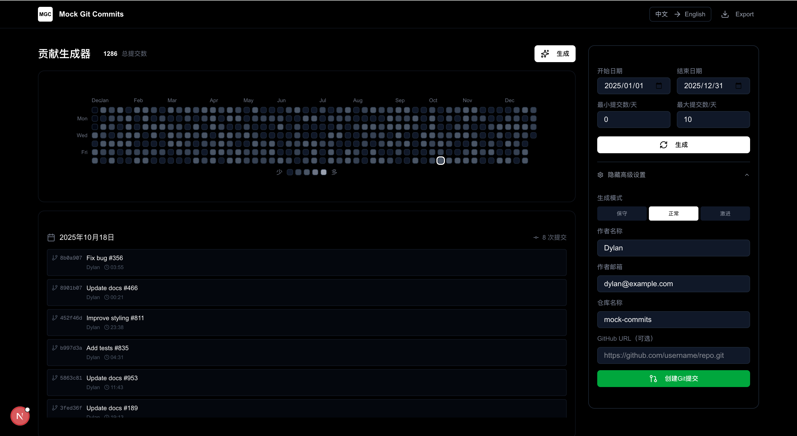
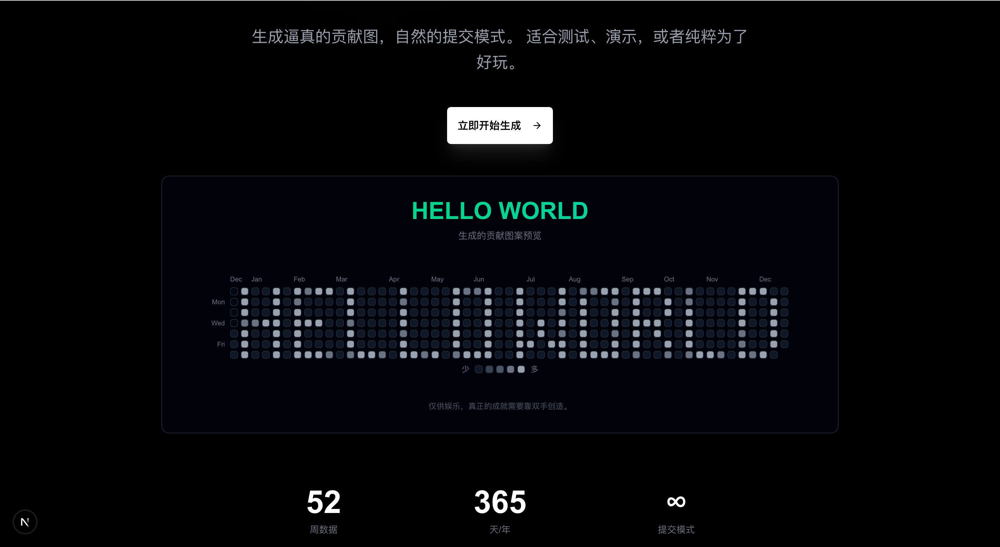

<div align="center">

# Mock Git Commits

### ✨ 生成逼真的 GitHub 贡献图 | Generate Realistic GitHub Contribution Graphs

[](https://github.com/Dylan-Nihilo/mock-git-commits)
[](https://github.com/Dylan-Nihilo/mock-git-commits)
[](https://github.com/Dylan-Nihilo/mock-git-commits/blob/main/LICENSE)

[](https://nextjs.org/)
[](https://react.dev/)
[](https://www.typescriptlang.org/)
[](https://tailwindcss.com/)

**创建逼真的 GitHub 贡献图，自然的提交模式。**

**Create stunning GitHub contribution graphs with realistic patterns.**

> ⚠️ 仅供娱乐，真正的成就需要靠双手创造。
>
> ⚠️ For entertainment purposes only. Real achievements require hard work.

[中文](#-功能特性) | [English](#-features)

</div>

---

## 📸 预览截图 | Screenshots

### 首页 HELLO WORLD 演示 | Landing Page Demo

<!-- 请替换为实际截图 | Replace with actual screenshot -->


### 生成器页面 | Generator Page

<!-- 请替换为实际截图 | Replace with actual screenshot -->



### 生成效果 | Result

<!-- 请替换为实际截图 | Replace with actual screenshot -->



---

## 🎯 功能特性

- **自定义日期范围** - 完全控制生成的时间段
- **逼真的提交模式** - 自然的提交分布，看起来真实可信
- **真实 Git 提交** - 生成实际的提交并推送到 GitHub
- **多种生成模式** - 保守、正常、激进三种模式
- **图案渲染** - 支持渲染文字或低像素图片到贡献图
- **隐私优先** - 所有数据都在浏览器本地处理
- **中英双语** - 支持中文和英文界面

---

## 🎯 Features

- **Custom Date Range** - Full control over the generation period
- **Realistic Patterns** - Natural commit distribution that looks authentic
- **Real Git Commits** - Generate actual commits and push to GitHub
- **Multiple Modes** - Conservative, Normal, or Aggressive generation
- **Pattern Rendering** - Render text or low-pixel images to contribution graph
- **Privacy First** - All data processed locally in your browser
- **Bilingual** - Support for Chinese and English interface

---

## 🚀 快速开始 | Quick Start

```bash
# 克隆项目 | Clone the project
git clone https://github.com/Dylan-Nihilo/mock-git-commits.git
cd mock-git-commits

# 安装依赖 | Install dependencies
npm install

# 启动开发服务器 | Start dev server
npm run dev
```

打开 | Open [http://localhost:3000](http://localhost:3000)

---

## 📖 使用步骤 | Usage

### 步骤 1：配置参数 | Step 1: Configure

在生成器页面配置以下参数：

Configure the following parameters on the generator page:

- **日期范围 | Date Range** - 选择开始和结束日期 | Select start and end dates
- **提交数量 | Commit Count** - 设置每天最小/最大提交数 | Set min/max commits per day
- **生成模式 | Generation Mode** - 选择保守/正常/激进模式 | Choose Conservative/Normal/Aggressive

### 步骤 2：生成预览 | Step 2: Generate Preview

点击 **"生成"** 按钮，预览贡献图效果。

Click **"Generate"** button to preview the contribution graph.

### 步骤 3：配置 Git 信息 | Step 3: Configure Git Info

```
作者名称 | Author Name: 你的 GitHub 显示名称 | Your GitHub display name
作者邮箱 | Author Email: 你的 GitHub 邮箱 | Your GitHub email (Important!)
仓库名称 | Repo Name: 隔离仓库的名称 | Isolated repository name
GitHub URL: (可选 | Optional) 远程仓库地址 | Remote repository URL
```

### 步骤 4：创建提交 | Step 4: Create Commits

点击 **"创建 Git 提交"** 按钮。

Click **"Create Git Commits"** button.

系统会在 `.mock-git-commits/` 目录下创建隔离的 Git 仓库。

Commits will be created in an isolated `.mock-git-commits/` directory.

### 步骤 5：推送到 GitHub | Step 5: Push to GitHub

**方式一：自动推送 | Auto Push**

- 在配置中填写 GitHub URL | Fill in GitHub URL in settings

**方式二：手动推送 | Manual Push**

```bash
cd .mock-git-commits/[仓库名]
git remote add origin https://github.com/YOUR_USERNAME/YOUR_REPO.git
git push -u origin main --force
```

> ⚠️ **重要 | Important:** Author Email 必须与 GitHub 账号邮箱一致！
>
> Author Email must match your GitHub account email!

---

## 🤝 贡献 | Contributing

欢迎贡献！请随时提交 Pull Request。

Contributions welcome! Feel free to submit a Pull Request.

---

## 📝 开源协议 | License

MIT © [Dylan](https://github.com/Dylan-Nihilo)

---

## 🙏 致谢 | Acknowledgments

Built with ❤️ using:

**AI Assistants:**

 [GLM-4.7](https://github.com/THUDM/GLM-4) - 智谱 AI 大模型

 [Claude Code](https://claude.ai) - Anthropic AI 编程助手

**Technologies:**

- [Next.js](https://nextjs.org/)
- [shadcn/ui](https://ui.shadcn.com/)
- [Lucide Icons](https://lucide.dev/)

---

<div align="center">

⭐ 如果觉得有用，请给个 Star！| If you find this useful, please give it a star!

</div>
